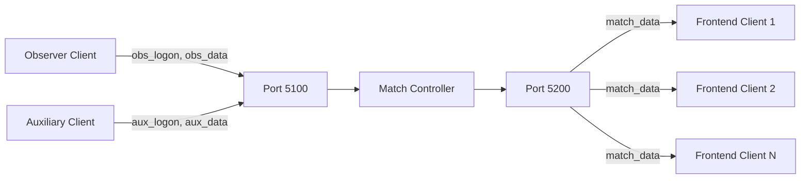

## Architecture

Spectra Server implements a **dual WebSocket architecture** using Socket.IO, separating incoming game data from outgoing frontend data for optimal performance and security.

### Port 5100: Incoming Game Data

Observer clients and auxiliary clients connect to port **5100** to send game data to the server.

- **Observer clients**: Send match data from VALORANT observer mode
- **Auxiliary clients**: Send player-specific data (abilities, health, scoreboard)
- **Authentication required**: All clients must authenticate before sending data
- **SSL/TLS support**: Configurable secure connections

### Port 5200: Outgoing Data Stream

Frontend applications connect to port **5200** to receive processed match data.

- **Room-based broadcasting**: Clients join rooms by `groupCode`
- **Filtered data**: Internal fields and secrets removed before emission
- **Real-time updates**: Instant `match_data` events as game state changes
- **No authentication required**: Simple logon with group code

## Socket.IO Configuration

Both WebSocket servers use identical Socket.IO compression settings for optimal bandwidth usage:

```typescript
const serverConfig = {
  perMessageDeflate: {
    zlibDeflateOptions: {
      chunkSize: 1024,
      memLevel: 7,
      level: 3,
    },
    zlibInflateOptions: {
      chunkSize: 10 * 1024,
    },
    threshold: 1024,
  },
  cors: { origin: "*" },
};
```

### Compression Settings

- **perMessageDeflate**: WebSocket compression enabled
- **Deflate chunk size**: 1KB for efficient memory usage
- **Deflate level**: 3 (balanced compression vs. speed)
- **Inflate chunk size**: 10KB for decompression buffer
- **Threshold**: Messages over 1KB are compressed

### CORS Configuration

- **origin**: `"*"` - All origins allowed
- Frontend clients can connect from any domain

<Note>
The wildcard CORS setting (`"*"`) allows connections from any origin. For production deployments, consider restricting this to specific domains.
</Note>

## SSL/TLS Support

Both servers support secure WebSocket connections (WSS) via SSL/TLS certificates.

### Configuration

Set environment variables to enable SSL:

```bash
INSECURE=false
SERVER_KEY=/path/to/private-key.pem
SERVER_CERT=/path/to/certificate.pem
```

### Insecure Mode

For development environments, disable SSL:

```bash
INSECURE=true
```

<Note>
When `INSECURE=true`, the server creates HTTP servers instead of HTTPS. This should only be used in local development environments.
</Note>

## Data Flow



1. **Observer/Auxiliary clients** authenticate and send game data to port 5100
2. **Match Controller** processes and validates incoming data
3. **Port 5200** broadcasts filtered data to all frontend clients in the room
4. **Frontend clients** receive real-time updates via `match_data` events

## Connection Lifecycle

### Incoming Clients (Port 5100)

1. Connect to `wss://server:5100` or `ws://server:5100`
2. Emit `obs_logon` or `aux_logon` event with authentication data
3. Receive `obs_logon_ack` or `aux_logon_ack` response
4. If authenticated, send `obs_data` or `aux_data` events
5. On disconnect, auxiliary clients are marked as disconnected

### Outgoing Clients (Port 5200)

1. Connect to `wss://server:5200` or `ws://server:5200`
2. Emit `logon` event with `groupCode`
3. Join room for that group code
4. Receive `logon_success` confirmation
5. Receive `match_data` events for that match

## Error Handling

Both servers implement error event listeners:

```typescript
ws.on("error", (e) => {
  // Error logged and handled gracefully
});
```

Connection errors are logged but do not crash the server. Clients should implement reconnection logic for network failures.

## Next Steps

<CardGroup cols={2}>
  <Card title="Incoming Connection" icon="arrow-down-to-bracket" href="./incoming-connection">
    Learn about port 5100 observer and auxiliary connections
  </Card>
  <Card title="Outgoing Connection" icon="arrow-up-from-bracket" href="./outgoing-connection">
    Learn about port 5200 frontend connections
  </Card>
  <Card title="Authentication" icon="key" href="./authentication">
    Understand observer and auxiliary authentication flows
  </Card>
  <Card title="Data Events" icon="table" href="./data-events">
    Explore event types and data schemas
  </Card>
</CardGroup>