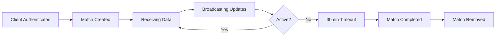

The MatchController handles the complete lifecycle of matches in Spectra Server, from creation through data synchronization to automatic cleanup.

## Match Lifecycle

Matches in Spectra Server go through several stages:



### 1. Match Creation

Matches are created during observer authentication:

```typescript
async createMatch(data: IAuthenticationData) {
  const existingMatch = this.matches[data.groupCode];
  if (existingMatch != null) {
    if (data.groupSecret !== existingMatch.groupSecret) {
      // Reject: different secret
      return "";
    }
    // Allow reconnection
    return "reconnected";
  }
  
  const newMatch = new Match(data);
  this.matches[data.groupCode] = newMatch;
  this.eventNumbers[data.groupCode] = 0;
  
  this.codeToTeamInfo[data.groupCode] = { 
    leftTeam: data.leftTeam, 
    rightTeam: data.rightTeam 
  };
  this.teamInfoExpiry[data.groupCode] = Date.now() + 1000 * 60 * 60; // 1 hour
  
  this.startOutgoingSendLoop();
  return newMatch.groupSecret;
}
```

Source: `src/controller/MatchController.ts:42-72`

<Note>
  The MatchController is a singleton, ensuring only one instance manages all matches across the server.
</Note>

### 2. Data Reception

The controller receives match data from authenticated clients:

```typescript
async receiveMatchData(data: IAuthedData | IAuthedAuxData) {
  data.timestamp = Date.now();

  // Observer data (has groupCode)
  if ("groupCode" in data) {
    const trackedMatch = this.matches[data.groupCode];
    if (trackedMatch == null) {
      return; // Invalid group code
    }
    await trackedMatch.receiveMatchSpecificData(data);
  } 
  // Auxiliary data (has matchId)
  else if ("matchId" in data) {
    for (const match of Object.values(this.matches)) {
      if (match.matchId == data.matchId) {
        await match.receiveMatchSpecificData(data);
      }
    }
  }
}
```

Source: `src/controller/MatchController.ts:96-117`

### 3. State Synchronization

The server broadcasts match updates to overlay clients at 10Hz (100ms intervals):

```typescript
private startOutgoingSendLoop() {
  if (this.sendInterval != null) return; // Already running
  
  this.sendInterval = setInterval(async () => {
    for (const groupCode in this.matches) {
      // Only send if there are new events
      if (this.matches[groupCode].eventNumber > this.eventNumbers[groupCode]) {
        this.outgoingWebsocketServer.sendMatchData(
          groupCode, 
          this.matches[groupCode]
        );
        this.eventNumbers[groupCode] = this.matches[groupCode].eventNumber;
        this.eventTimes[groupCode] = Date.now();
      }
    }
  }, 100); // 100ms = 10Hz
}
```

Source: `src/controller/MatchController.ts:154-185`

### 4. Automatic Cleanup

Matches are automatically cleaned up after 30 minutes of inactivity:

```typescript
// Check if the last event was more than 30 minutes ago
if (Date.now() - this.eventTimes[groupCode] > 1000 * 60 * 30) {
  Log.info(
    `Match with group code ${groupCode} has been inactive for more than 30 minutes, removing.`
  );

  try {
    if (this.matches[groupCode].isRegistered) {
      await DatabaseConnector.completeMatch(this.matches[groupCode]);
    }
  } catch (e) {
    Log.error(`Failed to complete match in backend with group code ${groupCode}, ${e}`);
  }

  this.removeMatch(groupCode);
}
```

Source: `src/controller/MatchController.ts:167-182`

<Warning>
  The 30-minute timeout starts from the last received event, not from match creation. Keep sending heartbeat events to prevent premature cleanup.
</Warning>

### 5. Manual Match Removal

Matches can also be removed manually:

```typescript
removeMatch(groupCode: string) {
  if (this.matches[groupCode] != null) {
    delete this.matches[groupCode];
    delete this.eventNumbers[groupCode];
    WebsocketIncoming.disconnectGroupCode(groupCode);
    
    // Stop send loop if no matches remain
    if (Object.keys(this.matches).length == 0 && this.sendInterval != null) {
      clearInterval(this.sendInterval);
      this.sendInterval = null;
    }
  }
}
```

Source: `src/controller/MatchController.ts:78-90`

## Group Codes and Match Identification

### Group Codes

Group codes are the primary identifier for matches:

- **Format**: 6-character alphanumeric string (recommended)
- **Uniqueness**: Must be unique across active matches
- **Case**: Usually uppercase for readability
- **Persistence**: Group code remains for 1 hour after match completion (for team info)

### Match IDs

Each match also has a unique match ID (UUID) used for:
- Auxiliary client authentication
- Backend API integration
- Cross-referencing match data

Find a match by its ID:

```typescript
findMatch(matchId: string) {
  return Object.values(this.matches)
    .find((match) => match.matchId == matchId)
    ?.groupCode ?? null;
}
```

Source: `src/controller/MatchController.ts:74-76`

## Team Configuration and Metadata

Team information is stored separately from match objects with its own expiry:

```typescript
private codeToTeamInfo: Record<string, { leftTeam: AuthTeam; rightTeam: AuthTeam }> = {};
private teamInfoExpiry: Record<string, number> = {};
```

### Team Data Structure

```typescript
interface AuthTeam {
  name: string;        // Full team name
  tricode: string;     // 3-4 letter abbreviation
  url: string;         // Team logo URL
  attackStart: boolean; // Which side starts attacking
}
```

### Team Info Cleanup

Team information expires 1 hour after match creation:

```typescript
const cleanupInterval = setInterval(() => {
  const now = Date.now();
  for (const groupCode in this.teamInfoExpiry) {
    if (now > this.teamInfoExpiry[groupCode]) {
      delete this.codeToTeamInfo[groupCode];
      delete this.teamInfoExpiry[groupCode];
    }
  }
}, 1000 * 60 * 5); // Check every 5 minutes
```

Source: `src/controller/MatchController.ts:22-34`

### Retrieving Team Information

```typescript
public getTeamInfoForCode(groupCode: string) {
  const teamInfo = this.codeToTeamInfo[groupCode];
  if (teamInfo) {
    return teamInfo;
  } else {
    return undefined;
  }
}
```

Source: `src/controller/MatchController.ts:188-195`

## Event Number Tracking

Each match has an event number that increments with every state change:

```typescript
private matches: Record<string, Match> = {};
private eventNumbers: Record<string, number> = {};
private eventTimes: Record<string, number> = {};
```

The event number is used to:
1. Track when new data is available
2. Determine if updates should be broadcast
3. Monitor match activity for cleanup

```typescript
if (this.matches[groupCode].eventNumber > this.eventNumbers[groupCode]) {
  // New event available, broadcast it
  this.outgoingWebsocketServer.sendMatchData(groupCode, this.matches[groupCode]);
  this.eventNumbers[groupCode] = this.matches[groupCode].eventNumber;
  this.eventTimes[groupCode] = Date.now();
}
```

Source: `src/controller/MatchController.ts:162-165`

## Auxiliary Client Management

The controller manages auxiliary client connections (player cameras, etc.):

```typescript
setAuxDisconnected(groupCode: string, playerId: string) {
  if (this.matches[groupCode] != null) {
    this.matches[groupCode].setAuxDisconnected(playerId);
  }
}
```

Source: `src/controller/MatchController.ts:128-132`

When an auxiliary client disconnects, the match is notified to update player camera states.

## Match Data for Overlay Logon

When a new overlay client connects, it receives the current match state:

```typescript
sendMatchDataForLogon(groupCode: string) {
  if (this.matches[groupCode] != null) {
    const {
      replayLog,
      eventNumber,
      timeoutEndTimeout,
      timeoutRemainingLoop,
      playercamUrl,
      ...formattedData
    } = this.matches[groupCode] as any;

    this.outgoingWebsocketServer.sendMatchData(groupCode, formattedData);
  }
}
```

Source: `src/controller/MatchController.ts:134-152`

<Note>
  Internal fields (replayLog, timeouts, etc.) are excluded from the data sent to overlay clients.
</Note>

## Monitoring Matches

### Get Active Match Count

```typescript
getMatchCount() {
  return Object.keys(this.matches).length;
}
```

Source: `src/controller/MatchController.ts:92-94`

## Best Practices

<Steps>
  <Step title="Use meaningful group codes">
    Choose group codes that are easy to communicate and unlikely to collide:
    
    ```typescript
    // Good
    groupCode: "FNATIC"
    groupCode: "MATCH1"
    
    // Avoid
    groupCode: "A"
    groupCode: "123"
    ```
  </Step>
  
  <Step title="Store group secrets securely">
    Save the group secret returned during authentication to enable reconnection:
    
    ```typescript
    const secret = acknowledgment.reason; // On successful auth
    // Store secret for reconnection
    ```
  </Step>
  
  <Step title="Send regular heartbeats">
    To prevent 30-minute timeout, send periodic events even during pauses:
    
    ```typescript
    // Send heartbeat every 5 minutes during long pauses
    setInterval(() => {
      sendMatchData({ type: "heartbeat", timestamp: Date.now() });
    }, 5 * 60 * 1000);
    ```
  </Step>
  
  <Step title="Handle reconnection gracefully">
    If connection drops, authenticate again with the same group code and secret:
    
    ```typescript
    if (response.reason === "reconnected") {
      // Successfully reconnected to existing match
    }
    ```
  </Step>
</Steps>