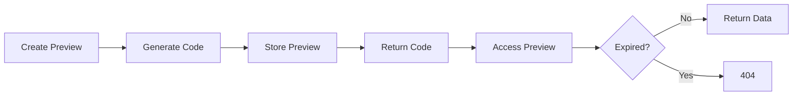

Preview mode allows you to test overlay configurations and designs without requiring a live VALORANT match. This is perfect for testing layouts, animations, and styling changes.

## Preview System Overview

The preview system creates temporary match states that can be accessed by overlay clients using preview codes. Previews automatically expire after 10 minutes.



Source: `src/util/previews/PreviewHandler.ts`

## Creating Previews

Create a preview by sending a PUT request to the server:

### Endpoint

```
PUT /createPreview
```

### Request Body

```json
{
  "key": "your-access-key",
  "previewCode": "CUSTOM",
  "leftTeam": {
    "name": "Sentinels",
    "tricode": "SEN",
    "url": "https://example.com/sentinels.png"
  },
  "rightTeam": {
    "name": "Fnatic",
    "tricode": "FNC",
    "url": "https://example.com/fnatic.png"
  },
  "toolsData": {
    "tournamentInfo": {
      "name": "VCT Masters",
      "logoUrl": "https://example.com/vct.png",
      "backdropUrl": "https://example.com/backdrop.png",
      "enabled": true
    },
    "seriesInfo": {
      "needed": 3,
      "wonLeft": 1,
      "wonRight": 1
    }
  }
}
```

### Response

```json
{
  "previewCode": "CUSTOM"
}
```

## Access Key Validation

Preview creation requires a valid access key:

```typescript
public async handlePreviewCreation(req: Request, res: Response) {
  const previewData: IPreviewData = req.body;
  
  if (!previewData.key || previewData.key == null) {
    return res.status(400).json({ error: "Missing or invalid key in preview data" });
  }

  const validity: KeyValidity = await this.wsi.isValidKey(previewData.key);
  if (!validity.valid) {
    return res.status(403).json({ error: "Invalid or expired key" });
  }
  
  previewData.organizationId = validity.organizationId;
  // Continue with preview creation...
}
```

Source: `src/util/previews/PreviewHandler.ts:23-34`

<Note>
  Preview creation uses the same authentication system as live matches. Set `REQUIRE_AUTH_KEY=false` for development or provide a valid access key.
</Note>

## Preview Code Generation

You can specify a custom preview code or let the server generate one:

### Custom Code

```json
{
  "previewCode": "MYCODE"
}
```

Must be exactly 6 characters.

### Auto-Generated Code

```typescript
let previewCode: string = previewData.previewCode;
if (!previewCode || previewCode.length !== 6) {
  for (let i = 0; i < 6; i++) {
    previewCode += validGroupcodeCharacters.charAt(
      Math.floor(Math.random() * validGroupcodeCharacters.length)
    );
  }
}

// Uppercase letters and digits, excluding I and O
const validGroupcodeCharacters = "ABCDEFGHJKLMNPQRSTUVWXYZ0123456789";
```

Source: `src/util/previews/PreviewHandler.ts:36-75`

## Preview Expiration

Previews automatically expire 10 minutes after creation:

```typescript
const previewMatch = new PreviewMatch(previewData);
this.previews.set(previewCode, previewMatch);

// Set a timeout to remove the preview after 10 minutes
if (this.previewTimeouts.has(previewCode)) {
  clearTimeout(this.previewTimeouts.get(previewCode)!);
  this.previewTimeouts.delete(previewCode);
}

const timeout = setTimeout(
  () => {
    this.previews.delete(previewCode);
    this.previewTimeouts.delete(previewCode);
  },
  10 * 60 * 1000 // 10 minutes
);

this.previewTimeouts.set(previewCode, timeout);
```

Source: `src/util/previews/PreviewHandler.ts:45-61`

<Warning>
  Previews expire exactly 10 minutes after creation, not after last access. Creating a new preview with the same code resets the expiration timer.
</Warning>

## Retrieving Previews

Access preview data using the preview code:

### Endpoint

```
GET /preview/:previewCode
```

### Implementation

```typescript
public getPreview(previewCode: string): PreviewMatch | undefined {
  return this.previews.get(previewCode);
}
```

Source: `src/util/previews/PreviewHandler.ts:69-71`

### Response

Returns the full preview match data or `undefined` if expired/not found.

## Example: Creating a Preview

<Steps>
  <Step title="Prepare preview data">
    Define your team and tournament configuration:
    
    ```javascript
    const previewData = {
      key: process.env.ACCESS_KEY,
      leftTeam: {
        name: "Team A",
        tricode: "TMA",
        url: "https://example.com/team-a.png"
      },
      rightTeam: {
        name: "Team B",
        tricode: "TMB",
        url: "https://example.com/team-b.png"
      },
      toolsData: {
        tournamentInfo: {
          name: "My Tournament",
          logoUrl: "https://example.com/tournament.png",
          enabled: true
        }
      }
    };
    ```
  </Step>
  
  <Step title="Send PUT request">
    ```javascript
    const response = await fetch('http://localhost:5100/createPreview', {
      method: 'PUT',
      headers: {
        'Content-Type': 'application/json'
      },
      body: JSON.stringify(previewData)
    });
    
    const result = await response.json();
    console.log('Preview code:', result.previewCode);
    ```
  </Step>
  
  <Step title="Access preview in overlay">
    Use the preview code in your overlay URL:
    
    ```
    http://localhost:3000/overlay?preview=ABC123
    ```
  </Step>
</Steps>

## Example: Full Preview Configuration

```json
{
  "key": "dev-key-12345",
  "previewCode": "DEMO01",
  "leftTeam": {
    "name": "Sentinels",
    "tricode": "SEN",
    "url": "https://example.com/sentinels.png"
  },
  "rightTeam": {
    "name": "Fnatic",
    "tricode": "FNC",
    "url": "https://example.com/fnatic.png"
  },
  "toolsData": {
    "tournamentInfo": {
      "name": "VCT Masters Tokyo",
      "logoUrl": "https://example.com/vct-masters.png",
      "backdropUrl": "https://example.com/tokyo-backdrop.png",
      "enabled": true
    },
    "seriesInfo": {
      "needed": 3,
      "wonLeft": 2,
      "wonRight": 1,
      "mapInfo": [
        {
          "type": "past",
          "map": "Ascent",
          "left": { "score": 13 },
          "right": { "score": 7 }
        },
        {
          "type": "past",
          "map": "Bind",
          "left": { "score": 11 },
          "right": { "score": 13 }
        },
        {
          "type": "present",
          "map": "Haven"
        },
        {
          "type": "future",
          "map": "Icebox"
        }
      ]
    },
    "seedingInfo": {
      "left": "Group A - 1st",
      "right": "Group B - 2nd"
    },
    "watermarkInfo": {
      "spectraWatermark": true,
      "customText": "VCT Masters",
      "customTextEnabled": true
    }
  }
}
```

## Use Cases

### Design Testing

Test overlay designs without running a match:

```bash
curl -X PUT http://localhost:5100/createPreview \
  -H "Content-Type: application/json" \
  -d '{"key":"dev-key","leftTeam":{...}}'
```

### Client Demonstrations

Create previews for client approval:

```javascript
const demoPreview = {
  key: ACCESS_KEY,
  previewCode: "CLIENT",
  leftTeam: clientTeam,
  rightTeam: opponentTeam,
  toolsData: {
    tournamentInfo: {
      name: clientTournament,
      logoUrl: clientLogo,
      enabled: true
    }
  }
};
```

### Automated Testing

Generate previews programmatically for testing:

```javascript
const testCases = [
  { scenario: 'close-game', wonLeft: 1, wonRight: 1 },
  { scenario: 'blowout', wonLeft: 2, wonRight: 0 },
  { scenario: 'comeback', wonLeft: 2, wonRight: 2 }
];

for (const test of testCases) {
  const preview = await createPreview({
    key: ACCESS_KEY,
    toolsData: {
      seriesInfo: {
        needed: 3,
        wonLeft: test.wonLeft,
        wonRight: test.wonRight
      }
    }
  });
  
  await runVisualTest(preview.previewCode);
}
```

## Error Handling

| Status Code | Error | Solution |
|------------|--------|----------|
| 400 | Missing or invalid key | Include valid access key in request body |
| 403 | Invalid or expired key | Check access key with backend |
| 400 | Invalid preview data | Verify request body format |

## Best Practices

<Steps>
  <Step title="Use descriptive preview codes">
    For manual testing, use meaningful codes:
    
    ```json
    {
      "previewCode": "DEMO01",  // Good
      "previewCode": "XY7K2P"   // Auto-generated, harder to remember
    }
    ```
  </Step>
  
  <Step title="Set reasonable expiration expectations">
    Remember previews expire after 10 minutes. For long sessions, recreate the preview or extend the system:
    
    ```javascript
    // Refresh preview every 8 minutes
    setInterval(() => {
      createPreview(previewData);
    }, 8 * 60 * 1000);
    ```
  </Step>
  
  <Step title="Include all relevant data">
    Provide complete `toolsData` to preview all overlay features:
    
    ```json
    {
      "toolsData": {
        "tournamentInfo": { /* ... */ },
        "seriesInfo": { /* ... */ },
        "seedingInfo": { /* ... */ },
        "watermarkInfo": { /* ... */ }
      }
    }
    ```
  </Step>
  
  <Step title="Clean up test previews">
    While previews auto-expire, clean up manually during development:
    
    ```javascript
    // After testing
    await deletePreview(previewCode); // If implemented
    // Or just wait 10 minutes for auto-cleanup
    ```
  </Step>
</Steps>

<Note>
  The preview system is perfect for testing overlay designs, but for testing event timing and animations, use the [replay system](/guides/replay-system) instead.
</Note>